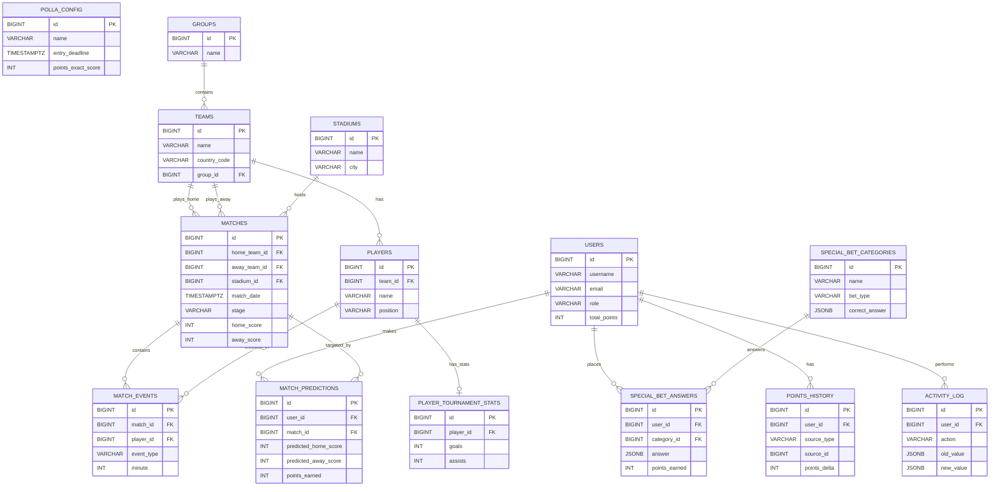

# Diagrama ERD - Polla Mundial 2026

```mermaid
erDiagram
    USERS ||--o{ MATCH_PREDICTIONS : makes
    USERS ||--o{ SPECIAL_BET_ANSWERS : places
    USERS ||--o{ POINTS_HISTORY : has
    USERS ||--o{ ACTIVITY_LOG : performs
    USERS {
        BIGINT id PK
        VARCHAR username
        VARCHAR email
        VARCHAR role
        INT total_points
    }
    
    POLLA_CONFIG {
        BIGINT id PK
        VARCHAR name
        TIMESTAMPTZ entry_deadline
        INT points_exact_score
    }

    GROUPS ||--o{ TEAMS : contains
    GROUPS {
        BIGINT id PK
        VARCHAR name
    }

    TEAMS ||--o{ MATCHES : plays_home
    TEAMS ||--o{ MATCHES : plays_away
    TEAMS ||--o{ PLAYERS : has
    TEAMS {
        BIGINT id PK
        VARCHAR name
        VARCHAR country_code
        BIGINT group_id FK
    }

    STADIUMS ||--o{ MATCHES : hosts
    STADIUMS {
        BIGINT id PK
        VARCHAR name
        VARCHAR city
    }

    MATCHES ||--o{ MATCH_EVENTS : contains
    MATCHES ||--o{ MATCH_PREDICTIONS : targeted_by
    MATCHES {
        BIGINT id PK
        BIGINT home_team_id FK
        BIGINT away_team_id FK
        BIGINT stadium_id FK
        TIMESTAMPTZ match_date
        VARCHAR stage
        INT home_score
        INT away_score
    }

    PLAYERS ||--o| PLAYER_TOURNAMENT_STATS : has_stats
    PLAYERS ||--o{ MATCH_EVENTS : involved_in
    PLAYERS {
        BIGINT id PK
        BIGINT team_id FK
        VARCHAR name
        VARCHAR position
    }

    PLAYER_TOURNAMENT_STATS {
        BIGINT id PK
        BIGINT player_id FK
        INT goals
        INT assists
    }

    MATCH_EVENTS {
        BIGINT id PK
        BIGINT match_id FK
        BIGINT player_id FK
        VARCHAR event_type
        INT minute
    }

    MATCH_PREDICTIONS {
        BIGINT id PK
        BIGINT user_id FK
        BIGINT match_id FK
        INT predicted_home_score
        INT predicted_away_score
        INT points_earned
    }

    SPECIAL_BET_CATEGORIES ||--o{ SPECIAL_BET_ANSWERS : answers
    SPECIAL_BET_CATEGORIES {
        BIGINT id PK
        VARCHAR name
        VARCHAR bet_type
        JSONB correct_answer
    }

    SPECIAL_BET_ANSWERS {
        BIGINT id PK
        BIGINT user_id FK
        BIGINT category_id FK
        JSONB answer
        INT points_earned
    }

    POINTS_HISTORY {
        BIGINT id PK
        BIGINT user_id FK
        VARCHAR source_type
        BIGINT source_id
        INT points_delta
    }

    ACTIVITY_LOG {
        BIGINT id PK
        BIGINT user_id FK
        VARCHAR action
        JSONB old_value
        JSONB new_value
    }
```
